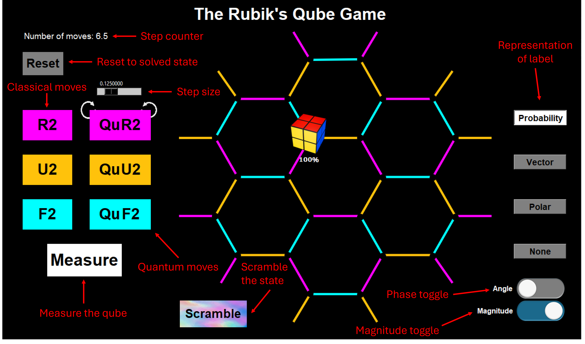
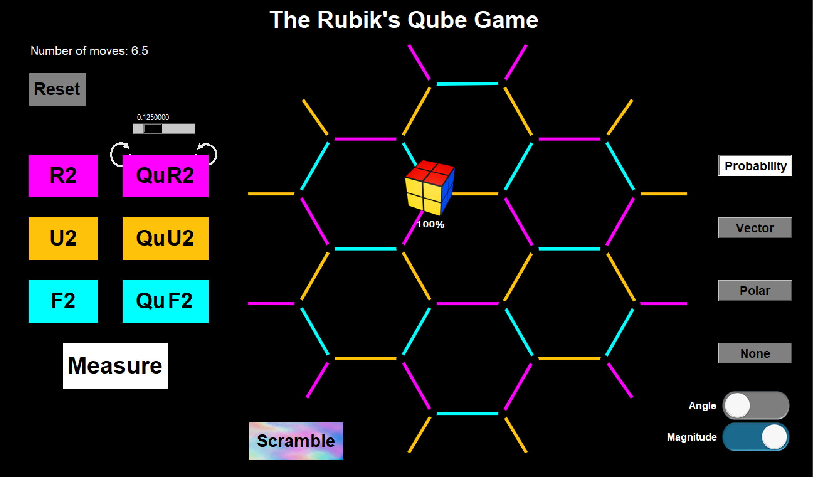
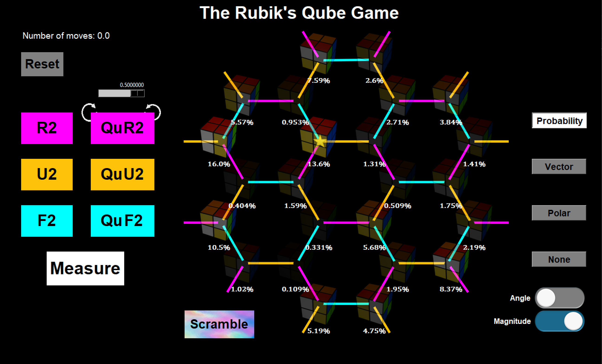
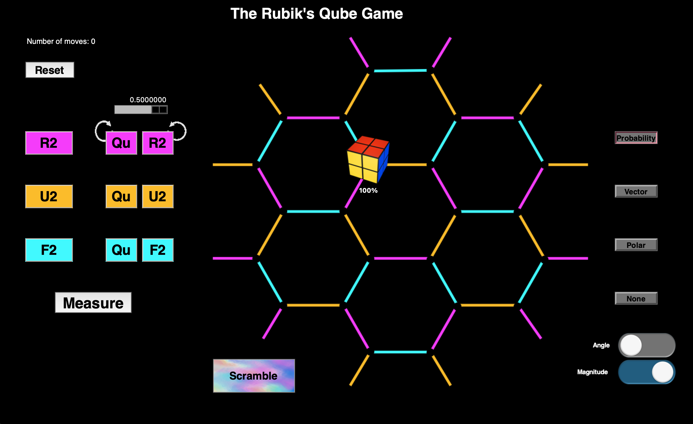
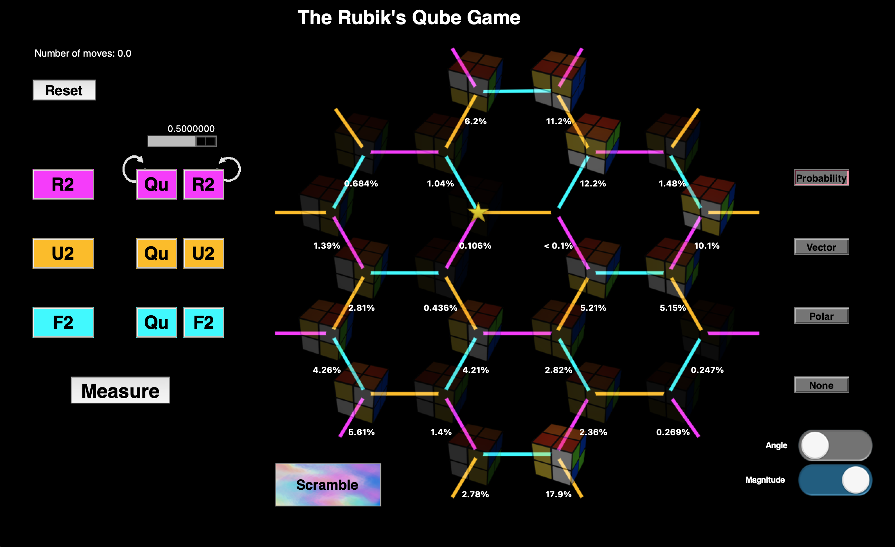

# The Qube Puzzle

Welcome!

Code for Karina Munro's 2025 Honours thesis at RMIT University and 2026 research paper (TBA).


Contact:
- Karina Munro
- karina.munro@rmit.edu.au

## Repository contents

| Folder | Contents | Status |
| --- | --- | --- |
| [Qubit encoding](qubit-encoding/) | PennyLane qubit program, dependencies, images, and instructions | Available |
| [Qudit encoding](qudit-encoding/) | MQT qudit program, dependencies, images, and instructions | Available |
| [Quick start](quick-start/) | Windows executables for both encodings | Available |
| [Classical transition checks](verification/classical_transition_check/) | Verify both encodings against the 24-state classical rules and Nauru graph | Available |

## Quick start on Windows

Download one of the executables from [quick-start](quick-start/):

- [Qubit version](quick-start/qubits_qube_puzzle.exe) — PennyLane encoding.
- [Qudit version](quick-start/qudits_qube_puzzle.exe) — MQT encoding.

On the file's GitHub page, choose **Download raw file**, then double-click the downloaded `.exe`. These packages bundle Python and the game images; you do not need to install Python or Conda separately. See the [quick-start instructions](quick-start/README.md) for details.

## Run from source

For macOS, Linux, or working with the Python code, follow the [qubit instructions](qubit-encoding/README.md) or [qudit instructions](qudit-encoding/README.md). Each version has its own dependencies and image folder. The `.exe` downloads are Windows applications.

## Reproduce the verification results

The verification script runs separately from the games and does not need the GUI or image files.

### Classical transitions

From the repository root:

```bash
python -m pip install -r verification/classical_transition_check/requirements.txt
python verification/classical_transition_check/check_nauru_encoding.py
```

A successful run reports 72/72 transitions for each encoding, passing Nauru graph checks, and agreement between the restricted qudit and qubit matrices. See the [classical transition README](verification/classical_transition_check/README.md) for individual checks and CSV output.

## Playing

To start the game, press the **Scramble** button. The aim of the game is to **Measure** the Qube and collapse the state to the solved state marked by the star ⭐. To increase your chances of solving the Qube, combine the amplitudes by using quantum **R2**, **U2**, and **F2** moves dictated by the **step size** (the sliding bar). Use the classical **R2**, **U2**, and **F2** moves to move the locations of basis states without changing the amplitudes.

Note: Click **Help**&#8594;**Keyboard Shortcuts** for shortcuts on all the functionalities.

The qudit version also retains the supplied MQT program's warning when a measurement cannot be completed.

## Interface guide

The screenshots below show the qubit version to illustrate the shared controls and layout. The qudit version uses four-digit basis-state labels (for example, `0000` and `1121`) for its 2 × 2 × 3 × 2 encoding, instead of the five-bit labels shown in these screenshots.



## Example screens

### Windows

Initial and scrambled views of the shared game interface:

 

### Mac

These examples show the Python source version on macOS; the downloadable executables run on Windows.

 

The repository-wide license is in [LICENSE](LICENSE).
