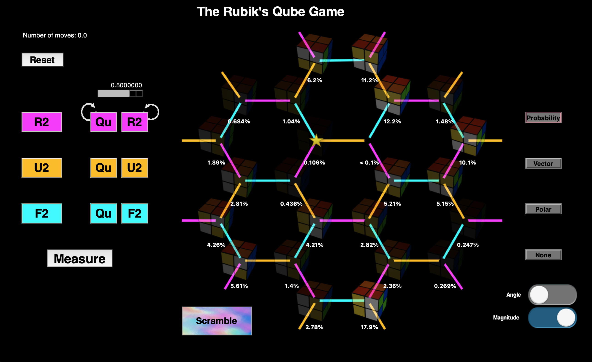

# The Qube Puzzle — Qudit Encoding

The MQT Qudits version of Karina Munro's Qube Puzzle uses four subsystems with dimensions **2 × 2 × 3 × 2**, representing the 24 puzzle states directly.

## Installation (Conda)

Use a separate environment for this version. These dependency versions match the existing Python 3.11.9 development environment.

1. Create and activate the environment:
   ```sh
   conda create -n qube-qudit python=3.11.9
   conda activate qube-qudit
   ```
2. Change into this folder:
   ```sh
   cd "<path-to-repository>/qudit-encoding"
   ```
3. Install the dependencies:
   ```sh
   python -m pip install -r requirements.txt
   ```
4. Run the game:
   ```sh
   python GUI_MQT_1.0.py
   ```

The GUI also requires Tkinter/Tk, normally included with Conda's Python. It is not a pip dependency. If Tkinter is missing, install it with `conda install tk`.

See the [MQT Qudits installation documentation](https://mqt.readthedocs.io/projects/qudits/en/stable/installation.html) for package installation details.

## Files

- `GUI_MQT_1.0.py`: game interface and MQT quantum simulation.
- `perm_matrices_MQT.py`: the R2, U2, and F2 permutation matrices.
- `images/`: basis-state images, backgrounds, and interface graphics.
- `requirements.txt`: Python dependencies.
- `docs/`: screenshots illustrating the game interface.

Keep the image folder and matrix module alongside the game script. Images are resolved relative to the script, so starting it from another directory also works. All image filenames and image references are lowercase.

## Playing

Press **Scramble** to begin. The aim is to **Measure** the Qube and collapse it to the solved state marked by the star. Use quantum **R2**, **U2**, and **F2** moves with the step-size slider to combine amplitudes. Classical moves rearrange the basis states without changing their amplitudes.

Open **Help → Keyboard Shortcuts** to see the controls. This version retains the behavior of the supplied MQT program, including its existing warning when a measurement cannot be completed.

## Interface guide

The screenshots below are reused from the qubit version to illustrate the shared controls and layout. The qudit version uses four-digit basis-state labels (for example, `0000` and `1121`) for its 2 × 2 × 3 × 2 encoding, instead of the five-bit labels shown in these screenshots.


## Example screens

### Windows

Initial and scrambled views of the shared game interface:

 

### Mac

 
